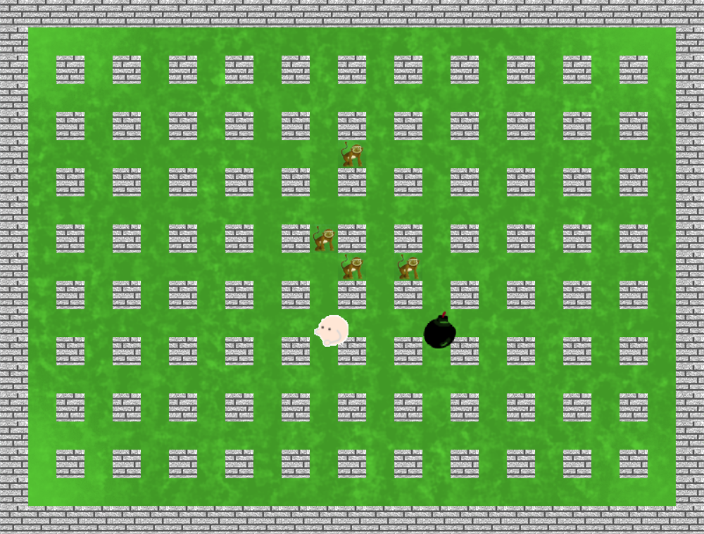
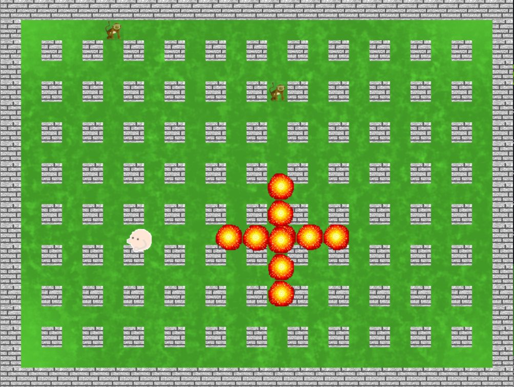

# Authors

* [Tomonike](https://github.com/Tomonike/)
* [WojtekMs](https://github.com/WOjtekMs/)
* [LogarithmDerivative](https://github.com/LogarithmDerivative/)

# Bomberman

Simple bomberman made with SFML in C++. Durning develomplent project changed to something like monkey hunter, but there is still plenty thigs TODO :)

# Requirements

To run the game you have to download SFML by command `sudo apt-get install libsfml-dev`.
Game works only on Linux!

# Running game
After entering game directory type following commands  
`mkdir build`  
`cd build/`  
`cmake ../`  
`make`  
`cd ../`  
`./Bomberman`  
And thats about it :)

# Gameplay
Monkeys are always chasing you and taking away your health, after 3 hits it's game over. Run away from them with `WSAD` and click `space` to place bomb that explodes after 3 seconds. Expolsion can kill monkeys but also damage the player.

# TODO

- Sometimes explosion doesn't show up
- Displaying player health
- Bomb's range should be based on distance to wall
